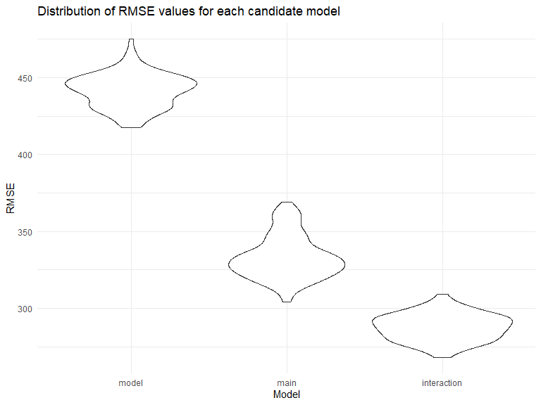

Homework 6
================
Chloe Chah

## Problem 1

### Create a city\_state variable and a binary variable indicating whether the homicide is solved. For this problem, limit your analysis those for whom victim\_race is white or black. Be sure that victim\_age is numeric.

``` r
urlfile="https://raw.githubusercontent.com/washingtonpost/data-homicides/master/homicide-data.csv"

data <- read_csv(url(urlfile))
```

    ## 
    ## -- Column specification --------------------------------------------------------
    ## cols(
    ##   uid = col_character(),
    ##   reported_date = col_double(),
    ##   victim_last = col_character(),
    ##   victim_first = col_character(),
    ##   victim_race = col_character(),
    ##   victim_age = col_character(),
    ##   victim_sex = col_character(),
    ##   city = col_character(),
    ##   state = col_character(),
    ##   lat = col_double(),
    ##   lon = col_double(),
    ##   disposition = col_character()
    ## )

``` r
homicide_df = 
  data %>% 
  mutate(
    city_state = str_c(city, state, sep = ", "),
    victim_age = as.numeric(victim_age),
    resolution = case_when(
      disposition == "Closed without arrest" ~ 0,
      disposition == "Open/No arrest"        ~ 0,
      disposition == "Closed by arrest"      ~ 1)
  ) %>% 
  filter(
    victim_race %in% c("White", "Black"),
    city_state != "Tulsa, AL") %>% 
  select(city_state, resolution, victim_age, victim_race, victim_sex)
```

### For the city of Baltimore, MD, use the glm function to fit a logistic regression with resolved vs unresolved as the outcome and victim age, sex and race as predictors. Save the output of glm as an R object; apply the broom::tidy to this object; and obtain the estimate and confidence interval of the adjusted odds ratio for solving homicides comparing non-white victims to white victims keeping all other variables fixed.

``` r
baltimore_df =
  homicide_df %>% 
  filter(city_state == "Baltimore, MD")
glm(resolution ~ victim_age + victim_race + victim_sex, 
    data = baltimore_df,
    family = binomial()) %>% 
  broom::tidy() %>% 
  mutate(
    OR = exp(estimate),
    CI_lower = exp(estimate - 1.96 * std.error),
    CI_upper = exp(estimate + 1.96 * std.error)
  ) %>% 
  select(term, OR, starts_with("CI")) %>% 
  knitr::kable(digits = 3)
```

| term              |    OR | CI\_lower | CI\_upper |
| :---------------- | ----: | --------: | --------: |
| (Intercept)       | 1.363 |     0.975 |     1.907 |
| victim\_age       | 0.993 |     0.987 |     1.000 |
| victim\_raceWhite | 2.320 |     1.648 |     3.268 |
| victim\_sexMale   | 0.426 |     0.325 |     0.558 |

### Now run glm for each of the cities in your dataset, and extract the adjusted odds ratio (and CI) for solving homicides comparing Black victims to white victims. Do this within a “tidy” pipeline, making use of purrr::map, list columns, and unnest as necessary to create a dataframe with estimated ORs and CIs for each city.

``` r
models_results_df = 
  homicide_df %>% 
  nest(data = -city_state) %>% 
  mutate(
    models = 
      map(.x = data, ~glm(resolution ~ victim_age + victim_race + victim_sex, data = .x, family = binomial())),
    results = map(models, broom::tidy)
  ) %>% 
  select(city_state, results) %>% 
  unnest(results) %>% 
  mutate(
    OR = exp(estimate),
    CI_lower = exp(estimate - 1.96 * std.error),
    CI_upper = exp(estimate + 1.96 * std.error)
  ) %>% 
  select(city_state, term, OR, starts_with("CI")) 
```

### Create a plot that shows the estimated ORs and CIs for each city. Organize cities according to estimated OR, and comment on the plot.

``` r
models_results_df %>% 
  filter(term == "victim_sexMale") %>% 
  mutate(city_state = fct_reorder(city_state, OR)) %>% 
  ggplot(aes(x = city_state, y = OR)) + 
  geom_point() + 
  geom_errorbar(aes(ymin = CI_lower, ymax = CI_upper)) + 
  theme(axis.text.x = element_text(angle = 90, hjust = 1))
```


## Problem 2

### Load and clean the data for regression analysis (i.e. convert numeric to factor where appropriate, check for missing data, etc.).

``` r
baby_df = 
  read_csv("./Data/birthweight.csv", na = c("", "NA", "Unknown")) %>%
  mutate(
    frace = as.factor(frace), 
    mrace = as.factor(mrace),
    babysex = as.factor(babysex),
    malform = as.factor(malform)
  )
```

    ## 
    ## -- Column specification --------------------------------------------------------
    ## cols(
    ##   .default = col_double()
    ## )
    ## i Use `spec()` for the full column specifications.

``` r
any(is.na(baby_df))
```

    ## [1] FALSE

``` r
head(baby_df)
```

    ## # A tibble: 6 x 20
    ##   babysex bhead blength   bwt delwt fincome frace gaweeks malform menarche
    ##   <fct>   <dbl>   <dbl> <dbl> <dbl>   <dbl> <fct>   <dbl> <fct>      <dbl>
    ## 1 2          34      51  3629   177      35 1        39.9 0             13
    ## 2 1          34      48  3062   156      65 2        25.9 0             14
    ## 3 2          36      50  3345   148      85 1        39.9 0             12
    ## 4 1          34      52  3062   157      55 1        40   0             14
    ## 5 2          34      52  3374   156       5 1        41.6 0             13
    ## 6 1          33      52  3374   129      55 1        40.7 0             12
    ## # ... with 10 more variables: mheight <dbl>, momage <dbl>, mrace <fct>,
    ## #   parity <dbl>, pnumlbw <dbl>, pnumsga <dbl>, ppbmi <dbl>, ppwt <dbl>,
    ## #   smoken <dbl>, wtgain <dbl>

There appears to be no missing data in this dataset. I’ve converted data
types that could be a combo box (e.g., sex, father’s race, mother’s
race, and presence of malformations that could affect weight) from
numeric to factors.

### Propose a regression model for birthweight. This model may be based on a hypothesized structure for the factors that underly birthweight, on a data-driven model-building process, or a combination of the two.

``` r
model_fit = lm(bwt ~ babysex + gaweeks + parity + ppwt + wtgain + momage, data = baby_df)
```

I included maternal factors (number of live births prior to this
pregnancy,mother’s pre-pregnancy weight, mother’s weight gain during
pregnancy, and mother’s age at delivery) because based on recent
publications, it appears that health conditions and characteristics of
mothers before and during pregnancy may directly affect the baby’s
birthweight.

### Show a plot of model residuals against fitted values – use add\_predictions and add\_residuals in making this plot.

``` r
baby_df %>% 
  add_predictions(model_fit) %>%
  add_residuals(model_fit) %>% 
  ggplot(aes(x = pred, y = resid)) + 
  geom_point() + 
  labs(title = "Fitted values vs. Residuals", 
      x = "Fitted values", 
      y = "Residuals")
```


Based on the residuals plot, the residuals appear to be relatively
evenly distributed. The variance of the residuals appear to be the same
for the most part. That is, the homoscedasticity assumption seems to be
met and the values are concentrated in the center and distributed in a
rectangular pattern (randomly scattered about a horizontal line). There
doesn’t seem to be any systematic pattern or clustering that is
considered a violation of the homoscedasticity assumption.

### Compare your model to one using length at birth and gestational age as predictors (main effects only) and to one using head circumference, length, sex, and all interactions (including the three-way interaction) between these.

``` r
cv_df = 
  crossv_mc(baby_df, 100) %>%
  mutate(
    model_fit = map(train, ~lm(bwt ~ babysex + gaweeks + parity + ppwt + wtgain + momage, data = baby_df)), 
    main_fit = map(train, ~lm(bwt ~blength + gaweeks, data = baby_df)), 
    interaction_fit = map(train, ~lm(bwt ~ bhead + blength + babysex + bhead*blength + bhead*babysex + blength*babysex + bhead*blength*babysex, data = baby_df))) %>%
  mutate(
    rmse_model = map2_dbl(model_fit, test, ~rmse(model = .x, data = .y)), 
    rmse_main = map2_dbl(main_fit, test, ~rmse(model = .x, data = .y)), 
    rmse_interaction = map2_dbl(interaction_fit, test, ~rmse(model = .x, data = .y))
  )

cv_df %>% 
  select(starts_with("rmse")) %>% 
  pivot_longer(
    everything(),
    names_to = "model", 
    values_to = "rmse",
    names_prefix = "rmse_") %>% 
  mutate(model = fct_inorder(model)) %>% 
  ggplot(aes(x = model, y = rmse)) + 
  geom_violin() + 
  labs(
    x = "Model", 
    y = "RMSE", 
    title = "Distribution of RMSE values for each candidate model"
  )
```



Based on these results, the model that I proposed has the highest RMSE
values compared to the main effects and interaction models. This could
be due to the fact that my model mainly included parental factors. If I
included more factors directly related to baby’s birthweight such as
baby’s head circumference at birth, my model might have performed
better. In fact, it appears that the interaction model is the best fit
for this dataset because lower RMSE values indicate better fit.

## Problem 3

### Load the data

``` r
weather_df = 
  rnoaa::meteo_pull_monitors(
    c("USW00094728"),
    var = c("PRCP", "TMIN", "TMAX"), 
    date_min = "2017-01-01",
    date_max = "2017-12-31") %>%
  mutate(
    name = recode(id, USW00094728 = "CentralPark_NY"),
    tmin = tmin / 10,
    tmax = tmax / 10) %>%
  select(name, id, everything())
```

    ## using cached file: C:\Users\kwcha\AppData\Local\cache/R/noaa_ghcnd/USW00094728.dly

    ## date created (size, mb): 2020-12-10 02:16:36 (7.552)

    ## file min/max dates: 1869-01-01 / 2020-12-31

``` r
head(weather_df)
```

    ## # A tibble: 6 x 6
    ##   name           id          date        prcp  tmax  tmin
    ##   <chr>          <chr>       <date>     <dbl> <dbl> <dbl>
    ## 1 CentralPark_NY USW00094728 2017-01-01     0   8.9   4.4
    ## 2 CentralPark_NY USW00094728 2017-01-02    53   5     2.8
    ## 3 CentralPark_NY USW00094728 2017-01-03   147   6.1   3.9
    ## 4 CentralPark_NY USW00094728 2017-01-04     0  11.1   1.1
    ## 5 CentralPark_NY USW00094728 2017-01-05     0   1.1  -2.7
    ## 6 CentralPark_NY USW00094728 2017-01-06    13   0.6  -3.8

### Use 5000 bootstrap samples and, for each bootstrap sample, produce estimates of r^2 and log(β<sup>0∗β</sup>1)

``` r
bootstrap_df = 
  weather_df %>%
  modelr::bootstrap(n = 5000) %>% 
  mutate(
    models = map(strap, ~lm(tmax ~ tmin, data = .x) ),
    results_r = map(models, broom::glance), 
    results_b = map(models, broom::tidy)) %>%
  janitor::clean_names()

r_squared = 
  bootstrap_df %>%
  select(-strap, -models) %>% 
  unnest(results_r) %>% 
  janitor::clean_names() %>%
  select(id, r_squared)

log_beta = 
  bootstrap_df %>%
  select(-strap, -models) %>% 
  unnest(results_b) %>% 
  select(id, term, estimate) %>%
  pivot_wider(
    names_from = term, 
    values_from = estimate)%>%
  janitor::clean_names() %>%
  mutate(
    log_b0_b1 = log(tmin*intercept)
  )
```

### Plot the distribution of r squared values

``` r
r_plot = 
  r_squared %>%
  ggplot(aes(x = r_squared)) +
  geom_density() + 
  labs(
    title = "Distribution of r-squared", 
    x = "R-squared", y = "Count"
  )

r_plot
```


Based on the distribution plot, it appears that the R-squared values
gathered from bootstrapping seem to be approximately normally
distributed or symmetric around a mean of 0.91.

### Plot the distribution of log(b0\*b1)

``` r
b_plot = 
  log_beta %>%
  ggplot(aes(x = log_b0_b1)) +
  geom_density() + 
  labs(
    title = "Distribution of log(b0*b1)", 
    x = "log_b0_b1", y = "Count"
  )

b_plot
```


Based on the distribution plot, it appears that the
log(β<sup>0∗β</sup>1) values gathered from bootstrapping seem to be
approximately normally distributed around a mean of 2.01. Compared to
the distribution plot for r-squared values, it does seem a little bit
more skewed to the left.

### Using the 5000 bootstrap estimates, identify the 2.5% and 97.5% quantiles to provide a 95% confidence interval for r^2 and log(β<sup>0∗β</sup>1)

``` r
log_beta %>%
  summarize(
    ci_lower = quantile(log_b0_b1, 0.025), 
    ci_upper = quantile(log_b0_b1, 0.975)
  ) %>%
  knitr::kable()
```

| ci\_lower | ci\_upper |
| --------: | --------: |
|  1.964008 |  2.059382 |

``` r
r_squared %>%
  summarize(
    ci_lower = quantile(r_squared, 0.025), 
    ci_upper = quantile(r_squared, 0.975)
  ) %>%
  knitr::kable()
```

| ci\_lower | ci\_upper |
| --------: | --------: |
| 0.8939293 | 0.9269456 |

The 95% confidence intervals for the log(β<sup>0∗β</sup>1) values is
(1.964469, 2.057902). The 95% confidence intervals for the r-squared
values is (0.8938043, 0.9270294)
